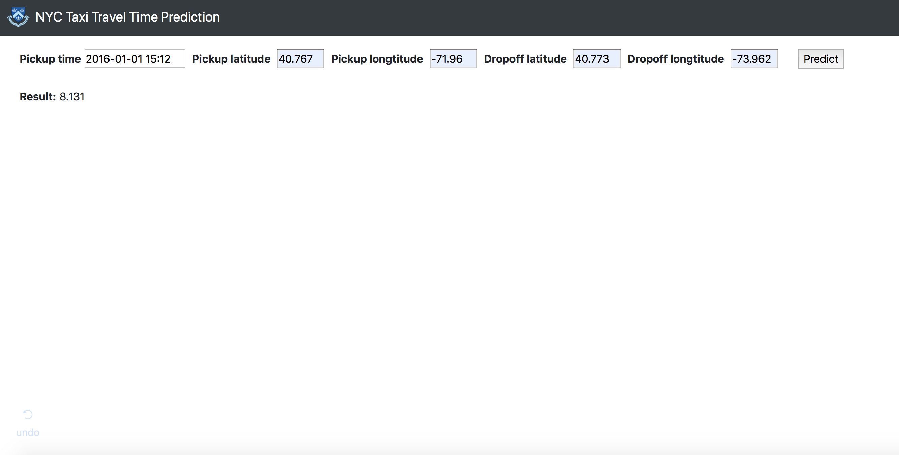

## NYC Taxi Travel Time Prediction APP

### introduction
The whole app built on plotly Dash framework (based on Flask). You could input pickup time, pickup latitude, longtitude and dropoff latitude and longtitude for getting a taxi travel time estimation.



### prediction model
**Model**: Ridge Stacking model with XGBoost, Random Forest and Gradient Boosting  
**Model evaluation**: **R2**: 0.7576 **RMSLE**: 0.3523 **RMSE**: 297.1756  

### Run App
open commend line window and input ```python index.py```

### Python packages requirement
```
pandas == '0.23.4'  
numpy == '1.16.1'  
xgboost == '0.82'  
sklearn == '0.20.1'  
dash '0.37.0'  
dash_core_components '0.43.1'  
dash_html_components '0.13.5'  
dash_bootstrap_components '0.3.3'  
plotly '3.4.2'  
```